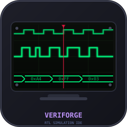
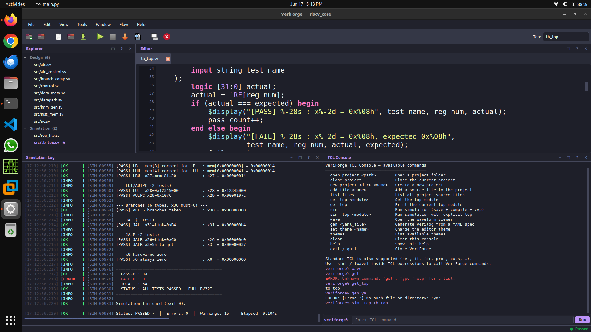
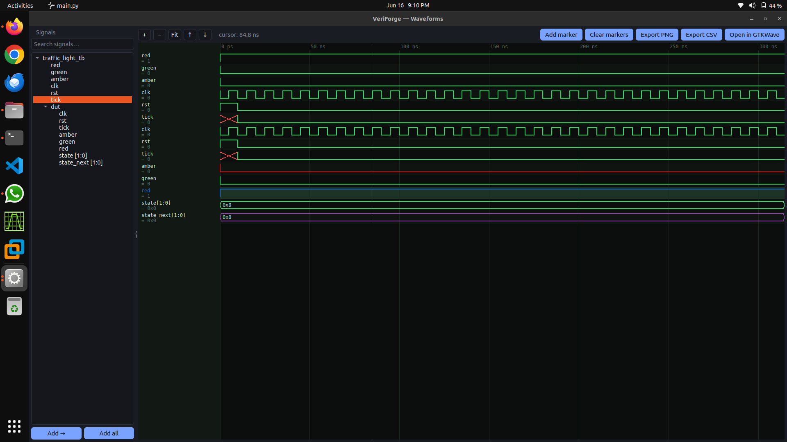
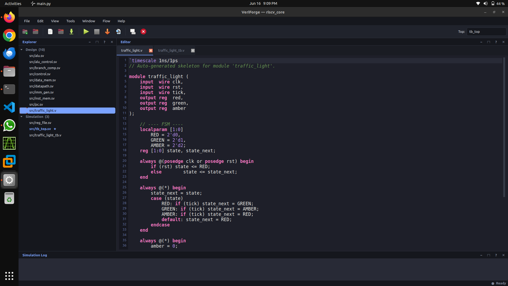
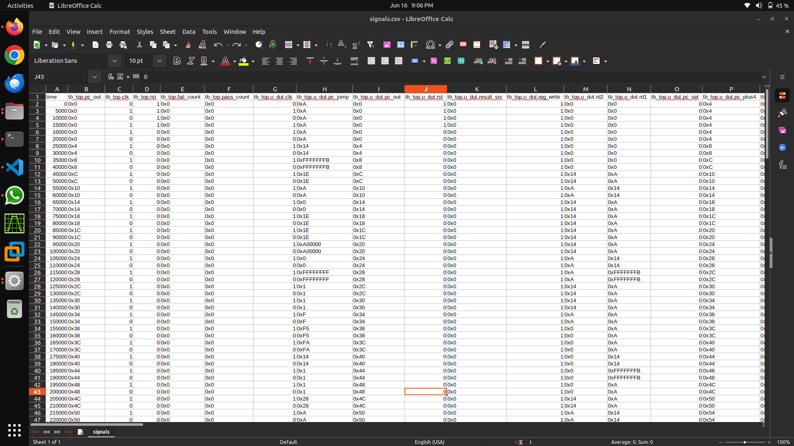

# VeriForge


**Open-source Verilog/SystemVerilog IDE for Linux. Write RTL, simulate, inspect waveforms — one window, no license fees.**



---


*Full IDE — RV32I RISC-V core simulation with live log and TCL console*

---

## Install

Download `veriforge_1.0.0_amd64.zip` from the [Releases](https://github.com/engrbilal992/veriforge/releases) page, then:

```bash
unzip veriforge_1.0.0_amd64.zip
sudo dpkg -i veriforge_1.0.0_amd64.deb
sudo apt install -f
veriforge
```

**Build from source:**

```bash
git clone https://github.com/engrbilal992/veriforge.git
cd veriforge
./install.sh
./veriforge
```

### Requirements

| | |
|---|---|
| OS | Ubuntu 22.04+, Debian 12+, Mint, Pop!\_OS, any apt-based distro |
| Python | 3.10+ |
| RAM | 256 MB |

---

## What it does

**F5 — Simulate.** Saves all open files, compiles and runs the simulation, streams output line-by-line to the log panel. Errors show in red and get underlined in the editor. Warnings in yellow.

**F7 — View waveform.** Opens the built-in VCD viewer. Arrow keys jump between signal edges. Set a time window (`From: 10ns  To: 150ns`) to crop the view. Export to PNG or CSV.

**F6 — Generate code.** Describe a module in YAML — ports, parameters, clocked logic, FSMs, testbench — press F6, get `.v` files.

**TCL console.** Type `sim`, `wave`, `set_top`, `open_project`, `gen` and standard TCL (`set`, `foreach`, `proc`) to script the full workflow.

---

## Features

- **Editor** — Verilog/SV syntax highlighting, Vim / Nano / Standard key modes, line-level error underlines after compile
- **Simulation** — timestamped log with message IDs, persistent logs in `logs/`
- **Waveform viewer** — native VCD parser, zoomable canvas, time-window crop (From/To), bus values in hex/dec/bin/signed/octal/ascii, markers + Δ time, PNG + CSV export
- **YAML codegen** — combinational assigns, clocked always blocks, FSMs, testbench scaffolding
- **TCL console** — real TCL interpreter; history with Up/Down
- **Themes** — Dracula (default), Monokai, One Dark, Solarized Dark, Light Blue, GitHub Light
- **Help** — F1: searchable, tabbed reference (Overview, Editor, Simulation, Waveform, YAML, TCL, Shortcuts)
- **CLI / CI** — non-GUI commands skip Qt entirely; run simulations on servers without a display

---

## Keyboard shortcuts

| Key | Action |
|---|---|
| F5 | Simulate |
| F6 | Generate from YAML |
| F7 | Open waveform viewer |
| F1 | Help |
| Ctrl+S | Save |
| Ctrl+N | New file |
| Ctrl+O | Open file |
| Ctrl+Shift+O | Open project |
| Ctrl+wheel | Zoom editor font |
| Ctrl+= / Ctrl+- | Zoom entire UI |
| Ctrl+\` | Open system terminal |

**Inside the waveform viewer:**

| Key | Action |
|---|---|
| Left / Right | Jump cursor to prev / next edge (selected signal) |
| Ctrl+A | Select all signals |
| Ctrl+click | Place a time marker |
| Delete | Remove selected signal from view |

---

## Waveform viewer


*Built-in VCD waveform viewer — black/green display, signal tree, markers, time cursor*

---

## YAML code generation


*Traffic light FSM generated from a YAML spec — ready to simulate with F5*

Create a `.yaml` file in the editor, press F6:

```yaml
module: counter
parameters: {WIDTH: 4}
ports:
  clk:   input
  rst:   input
  en:    input
  count: {dir: output, width: WIDTH, type: reg}

sequential:
  clock: clk
  reset: rst
  reset_value: {count: 0}
  logic:
    count: "en ? count + 1'b1 : count"

testbench:
  clock: clk
  reset: rst
  period: 10
  runtime: 200
  dump: true
```

Generates `counter.v` + `counter_tb.v`. Press F5 to simulate immediately.

Full spec reference: [`SPEC_REFERENCE.yaml`](SPEC_REFERENCE.yaml)

---

## CSV export


*Export any waveform to CSV — open in LibreOffice, Excel, or process with Python/pandas*

From the waveform viewer hit **Export CSV**, or via CLI:

```bash
./veriforge wave myproject --csv
```

---

## TCL console

```tcl
set_top counter_tb
sim

sim -top alu_tb

gen examples/spec_example.yaml

set_theme Monokai

themes

foreach tb {alu_tb fpu_tb mult_tb} {
    set_top $tb
    sim
}

help
```

---

## Full RV32I example

A complete single-cycle RISC-V core is at `examples/riscv_core/`. Runs 34 instruction tests.

**From the GUI:**

Open the project, set top module to `tb_top`, press F5. Watch the log, then F7 to open the waveform.

**From the TCL console:**

```tcl
open_project examples/riscv_core
set_top tb_top
sim
wave
```

**From the CLI:**

```bash
./veriforge sim examples/riscv_core --top tb_top
./veriforge wave examples/riscv_core
```

Expected output:

```
PASSED : 34   FAILED : 0   STATUS : ALL TESTS PASSED - FULL RV32I
```

The waveform has 85 signals covering PC, instruction decode, ALU, register file, and memory. Export to CSV from the viewer for post-processing.

---

## CLI

```bash
./veriforge new   myproject
./veriforge add   myproject alu.v
./veriforge gen   myproject spec.yaml
./veriforge sim   myproject --top alu_tb
./veriforge wave  myproject
./veriforge list  myproject
./veriforge open  myproject
```

---

## Project layout

```
myproject/
├── src/      source files
├── build/    compiler artifacts
├── sim/      VCD dumps
└── logs/     simulation logs
```

---

## Tests

```bash
QT_QPA_PLATFORM=offscreen python3 tests/run_tests.py
```

---

## Roadmap

- [x] Verilog/SV simulation with live log
- [x] Interactive VCD waveform viewer
- [x] YAML code generation (combinational, sequential, FSM)
- [x] TCL scripting console
- [x] Six themes, Dracula default
- [x] .deb package
- [ ] Simulation timeout watchdog
- [ ] Synthesis via Yosys
- [ ] Place & route via nextpnr
- [ ] Full RTL → GDSII (OpenROAD)

---

## License

MIT. See [LICENSE](LICENSE).
metadata refresh
